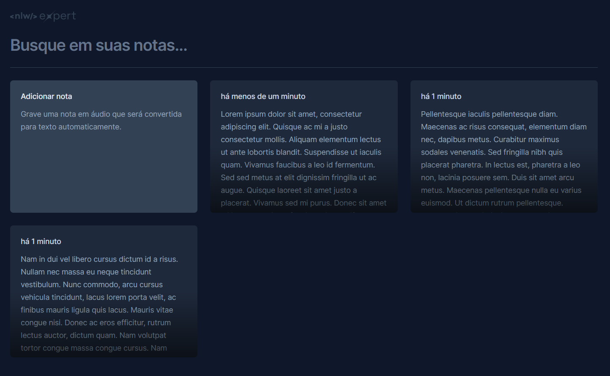

<h1 align="center"> NLW Expert Event - ReactJS - Note taking app </h1>

This project was built during RocketSeat's free online event "NLW Expert" which promoted the teaching of various technologies.

<p align="center">
  
</p>

## Utilized technologies, concepts and resources

- [ReactJS](https://react.dev/) - Interface - Used properties, states and components.
- [Typescript](https://www.typescriptlang.org/) - JavaScript typing.
- [Vite](https://vitejs.dev/) - Frontend tooling.
- [TailwindCSS](https://tailwindcss.com/) - Stylizing.
- Libraries
    - [Radix UI Component Library](https://www.radix-ui.com/) - [Dialog Component](https://www.radix-ui.com/primitives/docs/components/dialog).
    - [Lucide](https://lucide.dev/) - Icons.
    - [date-fns](https://date-fns.org/) - Date manipulation.
    - [Sonner](https://sonner.emilkowal.ski/) - Toast component.
    - [UUID](https://github.com/uuidjs/uuid#readme) - Generation of UUID as identifiers for the note components.
- Web APIs
    - [Web Storage API](https://developer.mozilla.org/en-US/docs/Web/API/Web_Storage_API) - [Save notes](https://developer.mozilla.org/en-US/docs/Web/API/Window/localStorage).
    - [Web Speech API](https://developer.mozilla.org/en-US/docs/Web/API/Web_Speech_API) - Write notes through [speech recognition](https://developer.mozilla.org/en-US/docs/Web/API/SpeechRecognition).

## Project

NLW Expert React Notes is a web application for note-taking with speech recognition capabilities.

## Installing and Running

Download the repository.
```
git clone https://github.com/GuiJRNunes/nlw-expert-react-notes.git
```

Move to the appropriate  folder.
```
cd .\nlw-expert-react-notes\
```

Install the dependencies.
```
npm install
```

Start the server in development mode.

```
npm run dev
```